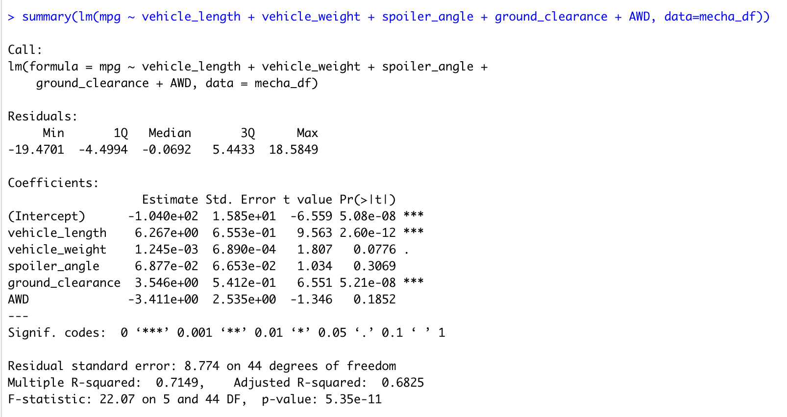
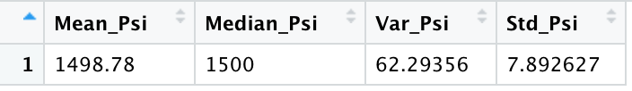
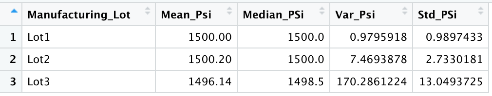
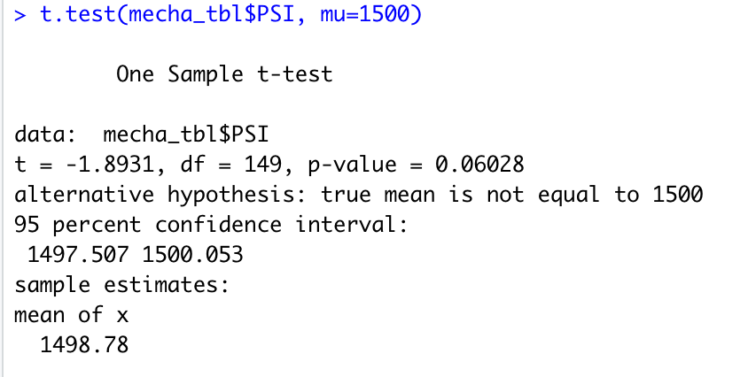
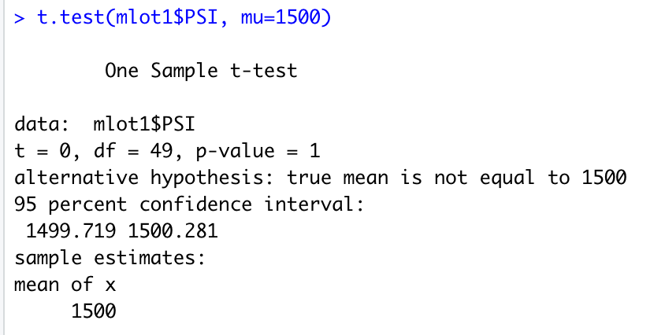
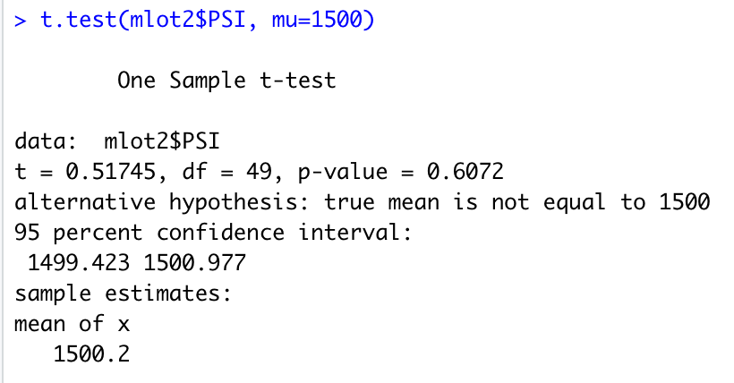
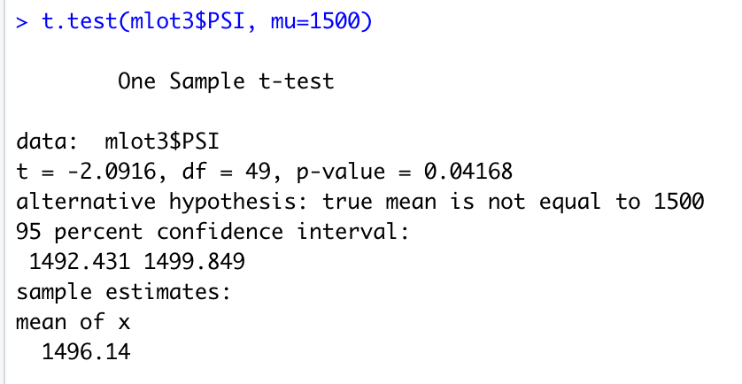

# Overview

In this challenge we review the production data of "MechaCar" to find insights that may help the manufacturing team.

## Goals

- Perform multiple linear regression analysis to identify which variables in the dataset predict the mpg of MechaCar prototypes.
- Collect summary statistics on the pounds per square inch (PSI) of the suspension coils from the manufacturing lots
- Run t-tests to determine if the manufacturing lots are statistically different from the mean population
- Design a statistical study to compare vehicle performance of the MechaCar vehicles against vehicles from other manufacturers.

## Linear Regression to Predict MPG

---

Which variables/coefficients provided a non-random amount of variance to the mpg values in the dataset?
Is the slope of the linear model considered to be zero? Why or why not?
Does this linear model predict mpg of MechaCar prototypes effectively? Why or why not?

---

The results from the statistical summary of the linear regression show that the variables "vehicle length" and "vehicle clearance" have a significant impact predicting mpg. Otherwise said, these variables provide a non-random amount of variance to the mpg values in the dataset.

The slope of the linear model is not zero, as it is possible to reject the null hypothesis given that the p-value of the summary is 5.35e-11, which is smaller than the significance level of .05. Moreover, the r-squared value shown in the summary is 0.7149 (adjusted r-squared is 0.6825). This indicates that the model captures around ~71% of mpg predictions, making it effective for predicting mpg of MechaCar prototypes.

## Summary Statistics on Suspension Coils

---

The design specifications for the MechaCar suspension coils dictate that the variance of the suspension coils must not exceed 100 pounds per square inch. Does the current manufacturing data meet this design specification for all manufacturing lots in total and each lot individually? Why or why not?

---

The variance of the suspension coils is 62.29 PSI, when considering all the manufacturing lots. This number is within the 100 PSI variance requirement.

However, when looking at the lots individually, lot 3 has a variance that exceeds 100 PSI.

Lot 1 has a variance of 0.979
Lot 2 has a variance of 7.469
Lot 3 has a variance of 170.286

## T-Tests on Suspension Coils

A t-test was performed on the suspension coil data to determine if all manufacturing lots and each lot individually are statistically different from the population mean of 1,500 PSI.

The results of the t-test for all the manufacturing show a p-value of .06, which is higher than the .05 significance level. This implies that there is not enough evidence to reject the null hypothesis. In others words, the mean of the manufacturing lots is not statistially different from the population mean of 1,500 PSI.

The results of the individual t-tests for lot 1 and lot 2, also show a p-value greater than our significance level of .05. As such, we cannot reject the null hypothesis. The mean of the manufacturing lots 1 and 2 are not statistically different form the population mean of 1,500 PSI.

The results of the the individual t-test on lot 3 shows a sample mean of 1496.14 and a p-value 0f .04. Since the p-value is below the significance level of .04, the null hypothesis can be rejected. Otherwise said, the mean of the manufacturing lot 3 is indeed statistically different from the population mean of 1,500 PSI.

## Study Design: MechaCar vs Competition

---

Using your knowledge of R, design a statistical study to compare performance of the MechaCar vehicles against performance of vehicles from other manufacturers.

---

It would be interesting to understand whether MechaCar cars are safer than other comparable cars.

A multiple linear regression could be run to determine whether MechaCar is statistically safer than comparable cars in the market based on key factors.

### Metrics to be tested

- Engine (independent variable)
- Speed (independent variable)
- Breaks technology (independent variable)
- Airbags technology (independent variable)
- Number of sales (independent variable)
- Number of fatal reported accidents (independent variable)
- Number of non-fatal reported accidents (independent variable)
- Number of recalls (independent variable)
- safety metric (dependent variable)

### Null hypothesis and alternative hypothesis

- Null hypothesis (Ho): MechaCar is statistically safer than comparable cars in the market based on key factors.
- Alternative Hypothesis (Ha): MechaCar is not statistically safer than comparable cars in the market base don key factors.
